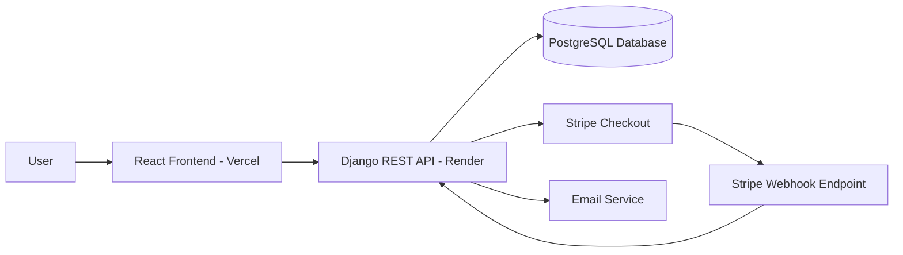

# 🏔️ UK Summit Guides

[]()
[]()
[]()
[]()
[]()
[]()
[]()
[]()
[]()
[]()


---

## 📚 Table of Contents

- [📸 Preview](#-preview)
- [🌐 Live Project](#-live-project)
- [📖 Overview](#-overview)
- [🎯 UX / UI Inspiration](#-ux--ui-inspiration)
- [🗂️ Project Management](#️-project-management)
- [🚀 Key Features](#-key-features)
- [🏗️ Tech Stack](#️-tech-stack)
- [🧠 Architecture Overview](#-architecture-overview)
- [🔌 API Overview](#-api-overview)
- [📂 Project Structure](#-project-structure)
- [⚙️ Local Setup & Installation](#️-local-setup--installation)
- [💳 Stripe Webhook Local Testing](#-stripe-webhook-local-testing)
- [📧 Email System](#-email-system)
- [🗺️ GPX Mapping & Weather Integration](#️-gpx-mapping--weather-integration)
- [👨‍💼 Django Admin](#-django-admin)
- [🎨 Frontend Experience & UI Decisions](#-frontend-experience--ui-decisions)
- [🧪 Testing](#-testing)
- [📈 Lighthouse & Validation](#-lighthouse--validation)
- [🚀 Deployment](#-deployment)
- [🧩 Challenges & Solutions](#-challenges--solutions)
- [📌 Future Enhancements](#-future-enhancements)
- [📈 Business Context & Value](#-business-context--value)
- [🎤 Talking Points](#-talking-points)
- [📬 Contact](#-contact)
- [⭐ Final Notes](#-final-notes)

---

## 📸 Preview

### 🏠 Homepage


---

### 🗺️ Routes Page


---

### 📍 Route Detail + GPX Map


---

### 💳 Booking Flow


---

### 📱 Mobile Experience


---

### 👤 Account Dashboard


---

## 🌐 Live Project

- 🔗 Frontend: **[https://uk-summit-guides.vercel.app](https://uk-summit-guides.vercel.app)**
- 🔗 Backend API: **[https://uk-summit-guides-api.onrender.com/api](https://uk-summit-guides-api.onrender.com/api)**

---

## 📖 Overview

**UK Summit Guides** is a full-stack booking platform designed around guided mountain experiences across the UK.

The project combines:

- Structured route discovery
- Interactive GPX-powered mapping
- Scheduled guided tours
- Real-time booking validation
- Stripe-powered payments
- Automated email workflows
- Account-based booking management
- Responsive UX across desktop and mobile

The overall aim of the project was to create something that feels much closer to a real commercial platform rather than a simple portfolio CRUD application.

A major focus throughout development has been:

- Clean frontend presentation
- Reliable backend workflows
- Real-world booking logic
- Premium UX/UI styling
- Scalability and maintainability
- Production-style deployment

The project uses a decoupled architecture with:

- React + Vite frontend
- Django REST API backend
- PostgreSQL database
- Stripe payment integration
- Leaflet GPX route mapping
- Transactional email workflows
- Render + Vercel deployment

---

## 🎯 UX / UI Inspiration

A large part of the project focused on creating a more premium, editorial-style experience rather than a generic booking site.

The visual direction was inspired by:

- Mountain photography and alpine guide brands
- Editorial layouts
- Dark premium UI systems
- Winter expedition aesthetics
- Layered glassmorphism surfaces
- Interactive route-focused experiences

Core UI decisions included:

- Winter/summer theme switching
- Atmospheric hero overlays
- Subtle red accent framing
- Large scenic imagery
- Motion-based reveals and transitions
- Soft layered shadows
- Responsive content spacing
- Mobile-first interaction improvements

### ✏️ Wireframes & Planning

Initial layout ideas, UX notes, route page structures, and booking flow planning were tracked through wireframes and iterative UI mockups.

#### Homepage Wireframe


#### Booking Flow Wireframe


#### Mobile UX Mockup


---

## 🗂️ Project Management

This project was tracked through a GitHub Project board covering:

- Frontend features
- Backend systems
- Payments
- Booking workflows
- Email systems
- Testing
- Deployment
- UI/UX improvements
- Documentation

### GitHub Project Board

- [Project Board — UK Summit Guides MVP Roadmap](https://github.com/users/TGOSS1984/projects/5/views/1)
- [GitHub Issues](https://github.com/TGOSS1984/uk-summit-guides/issues)

### Workflow Structure

The project board followed a structured workflow:

- **Todo** — planned work
- **In Progress** — active development
- **Done** — completed and tested work

Tracked development areas included:

- Stripe payment lifecycle
- Route discovery and filtering
- GPX map rendering
- Booking amendment/cancellation
- Email workflows
- Frontend responsiveness
- Weather integration
- Deployment configuration
- Automated testing
- Documentation improvements

---

## 🚀 Key Features

### 🗺️ Route Discovery

- Dynamic route data from Django REST API
- Route filtering by:
  - Region
  - Difficulty
  - Search
- Pagination support
- Featured routes system
- Responsive route cards
- Dedicated route detail pages

---

### 📍 Interactive GPX Mapping

- Leaflet-powered route maps
- GPX route overlay support
- Automatic route plotting
- Zoom-to-fit GPX route bounds
- Start/end route markers
- Route centre fallback coordinates
- Responsive mobile map layouts

---

### 🌦️ Weather Integration

Each route detail page includes:

- Live weather forecast integration
- Open-Meteo API integration
- Daily forecast cards
- Weather icons and condition mapping
- Temperature/wind/precipitation display
- External weather links for additional planning

External planning links include:

- MWIS
- Met Office
- Mountain Forecast

The weather feature is intentionally presented as guidance only rather than safety-critical forecasting.

---

### 👤 User Authentication

- Register
- Login
- Logout
- Authenticated sessions
- Token-based frontend auth handling
- Current user endpoint
- Protected booking/account routes

---

### 📅 Booking System

- Scheduled guided tours
- Capacity-based availability validation
- Real-time booking checks
- Booking lifecycle management
- Booking amendment flow
- Booking cancellation flow
- Booking archive tools
- User booking dashboard

---

### 💳 Stripe Payments

- Stripe Checkout integration
- Dynamic checkout sessions
- Secure webhook handling
- Payment confirmation lifecycle
- Duplicate payment prevention
- Refund support
- Success/cancel return pages

---

### 📧 Email Workflows

Email functionality is fully wired into the backend.

Current email flows include:

- Booking confirmation emails
- Payment confirmation emails
- Cancellation emails
- Refund notification emails
- Contact form acknowledgement emails
- Admin notification emails

Development uses console email output locally, while production uses environment-based email configuration.

---

### 📱 Responsive Frontend

The frontend was designed to work cleanly across:

- Desktop
- Tablet
- Mobile devices

Responsive improvements include:

- Mobile navigation
- Responsive route cards
- Swipe-friendly forecast layouts
- Adaptive spacing
- Theme-aware layouts
- Scalable typography
- Optimised mobile CTAs

---

### 🎨 Animation & Interaction

The frontend uses layered motion and reveal effects throughout the site.

This includes:

- Framer Motion reveal animations
- Scroll-triggered transitions
- Animated statistics counters
- Hover interactions
- Animated hero sections
- Dynamic featured route transitions

The aim was to keep interactions subtle rather than over-animated.

---

## 🏗️ Tech Stack

### Frontend

- React
- Vite
- React Router
- Framer Motion
- Leaflet
- React Icons
- Custom CSS design system

### Backend

- Django
- Django REST Framework
- PostgreSQL
- Django ORM
- Stripe SDK

### Infrastructure & Deployment

- Vercel frontend deployment
- Render backend deployment
- PostgreSQL database
- GitHub version control

---

## 🧠 Architecture Overview

The project uses a decoupled architecture.

The React frontend consumes data entirely through the Django REST API.



### Key Architectural Decisions

#### API-First Design

The frontend communicates exclusively through REST endpoints.

This allows future expansion into:

- Mobile apps
- Third-party integrations
- Additional frontend clients

#### Webhook-Driven Payments

Stripe webhooks are responsible for confirming payment success.

This avoids relying on frontend redirects alone and creates a more reliable payment workflow.

#### Separation of Concerns

Apps are separated by responsibility:

- `accounts` → authentication
- `bookings` → booking lifecycle
- `payments` → Stripe/payment handling
- `routes_app` → route discovery and route data
- `contact` → contact workflows

#### Stateless Frontend

Critical validation and business logic remain server-side.

This includes:

- Capacity checks
- Payment validation
- Booking permissions
- Refund handling

---

## 🔌 API Overview

### Authentication

| Method | Endpoint | Description |
|---|---|---|
| POST | `/api/auth/register/` | Create account |
| POST | `/api/auth/login/` | Login |
| POST | `/api/auth/logout/` | Logout |
| GET | `/api/auth/me/` | Current user |

---

### Routes & Regions

| Method | Endpoint | Description |
|---|---|---|
| GET | `/api/routes/` | List routes |
| GET | `/api/routes/<slug>/` | Route detail |
| GET | `/api/routes/<slug>/weather/` | Weather forecast |
| GET | `/api/regions/` | Regions |
| GET | `/api/scheduled-tours/` | Available departures |

---

### Bookings

| Method | Endpoint | Description |
|---|---|---|
| POST | `/api/bookings/` | Create booking |
| GET | `/api/my-bookings/` | User bookings |
| PATCH | `/api/my-bookings/<id>/amend/` | Amend booking |
| PATCH | `/api/my-bookings/<id>/cancel/` | Cancel booking |
| PATCH | `/api/my-bookings/<id>/refund/` | Refund booking |
| PATCH | `/api/my-bookings/<id>/archive/` | Archive booking |

---

### Payments

| Method | Endpoint | Description |
|---|---|---|
| POST | `/api/payments/create-checkout-session/` | Stripe checkout session |
| GET | `/api/payments/checkout-session/<id>/` | Session status |
| POST | `/api/payments/webhook/` | Stripe webhook |

---

### Contact

| Method | Endpoint | Description |
|---|---|---|
| POST | `/api/contact/` | Contact form submission |

---

## 📂 Project Structure

```bash
uk-summit-guides/
│
├── backend/
│   ├── accounts/
│   ├── bookings/
│   ├── contact/
│   ├── payments/
│   ├── routes_app/
│   ├── fixtures/
│   ├── config/
│   └── manage.py
│
├── frontend/
│   ├── src/
│   │   ├── components/
│   │   ├── pages/
│   │   ├── lib/
│   │   ├── styles/
│   │   └── data/
│   │
│   ├── public/
│   │   ├── images/
│   │   └── gpx/
│   │
│   └── package.json
│
└── README.md
```

---

## ⚙️ Local Setup & Installation

### 1. Clone Repository

```bash
git clone https://github.com/yourusername/uk-summit-guides.git

cd uk-summit-guides
```

---

## ⚙️ Backend Setup

### Create Virtual Environment

```bash
cd backend

python -m venv .venv
```

### Activate Virtual Environment

#### Windows

```bash
.venv\Scripts\activate
```

#### Mac/Linux

```bash
source .venv/bin/activate
```

### Install Dependencies

```bash
pip install -r requirements.txt
```

### Create `.env`

```env
DJANGO_SECRET_KEY=your-secret-key
DJANGO_DEBUG=True

ALLOWED_HOSTS=127.0.0.1,localhost

FRONTEND_BASE_URL=http://localhost:5175

DATABASE_URL=your-postgres-url

STRIPE_SECRET_KEY=your-secret-key
STRIPE_PUBLISHABLE_KEY=your-publishable-key
STRIPE_WEBHOOK_SECRET=your-webhook-secret

EMAIL_BACKEND=django.core.mail.backends.console.EmailBackend

DEFAULT_FROM_EMAIL=hello@uksummitguides.com
CONTACT_NOTIFICATION_EMAIL=admin@example.com
```

### Run Migrations

```bash
python manage.py migrate
```

### Create Superuser

```bash
python manage.py createsuperuser
```

### Load Fixtures

```bash
python manage.py loaddata fixtures/regions.json
python manage.py loaddata fixtures/guides.json
python manage.py loaddata fixtures/routes.json
python manage.py loaddata fixtures/scheduled_tours.json
```

### Run Backend

```bash
python manage.py runserver
```

Backend default:

```text
http://127.0.0.1:8000
```

---

## ⚙️ Frontend Setup

```bash
cd frontend

npm install

npm run dev
```

Frontend default:

```text
http://localhost:5175
```

---

## 💳 Stripe Webhook Local Testing

Install Stripe CLI:

```bash
stripe login
```

Run local webhook forwarding:

```bash
stripe listen --forward-to localhost:8000/api/payments/webhook/
```

Copy the webhook secret into `.env`:

```env
STRIPE_WEBHOOK_SECRET=whsec_xxxxx
```

---

## 📧 Email System

### Development

Local development uses Django console email backend.

Emails appear directly in the terminal for testing.

### Production

Production email configuration uses environment variables.

Supported workflows include:

- Booking confirmations
- Payment confirmations
- Refund notifications
- Contact acknowledgements
- Admin notifications

---

## 🗺️ GPX Mapping & Weather Integration

### GPX Mapping

Route GPX files are stored in:

```text
frontend/public/gpx/
```

Maps are rendered using:

- Leaflet
- React Leaflet
- GPX XML parsing
- Dynamic polyline rendering

### Weather API

Weather data is powered by:

- Open-Meteo API

The backend handles:

- Forecast requests
- Weather code mapping
- Rate-limit handling
- API fallback responses

External planning resources are also linked from route detail pages.

---

## 👨‍💼 Django Admin

The Django admin panel is used for managing:

- Routes
- Regions
- Guides
- Scheduled tours
- Bookings
- Payments
- Contact submissions
- User accounts

Admin URL:

```text
http://127.0.0.1:8000/admin/
```

---

## 🎨 Frontend Experience & UI Decisions

### Theme System

The frontend includes:

- Winter theme
- Summer theme
- Theme-aware imagery
- Theme-aware overlays
- LocalStorage theme persistence

### Responsive Design

Layouts were built mobile-first and adjusted progressively for:

- Tablet
- Desktop
- Large displays

### Motion & Reveal Effects

Reveal animations were added to:

- Hero sections
- Cards
- Editorial sections
- Route panels
- Stats counters

Animations were intentionally kept subtle to match the premium visual direction.

---

## 🧪 Testing

### Backend Testing

Backend tests use:

- Django TestCase
- DRF APITestCase
- Coverage.py

Covered areas include:

- Authentication
- Route endpoints
- Booking lifecycle
- Capacity validation
- Refund handling
- Stripe webhooks
- Contact forms
- Permissions

### Run Backend Tests

```bash
cd backend

python manage.py test
```

Coverage:

```bash
coverage run manage.py test
coverage report
coverage html
```

HTML report:

```text
backend/htmlcov/index.html
```

### Frontend Testing

Frontend tests use:

- Vitest
- React Testing Library

Current frontend tests focus on:

- Helper utilities
- Auth token logic
- Formatting helpers
- Basic smoke coverage

### Run Frontend Tests

```bash
cd frontend

npm run test:run
```

Coverage:

```bash
npm run test:coverage
```

---

## ✅ Manual Testing Examples

The full deployed flow has also been manually tested.

### Authentication

| Test | Result |
|---|---|
| Register account | Pass |
| Login/logout | Pass |
| Invalid credentials | Pass |
| Protected routes | Pass |

### Bookings

| Test | Result |
|---|---|
| Create booking | Pass |
| Capacity validation | Pass |
| Cancel booking | Pass |
| Archive booking | Pass |
| Refund workflow | Pass |

### Payments

| Test | Result |
|---|---|
| Stripe Checkout session | Pass |
| Payment success redirect | Pass |
| Webhook confirmation | Pass |
| Duplicate payment prevention | Pass |

### Emails

| Test | Result |
|---|---|
| Booking email | Pass |
| Refund email | Pass |
| Contact acknowledgement | Pass |

### Mobile UX

| Test | Result |
|---|---|
| Mobile navigation | Pass |
| Route cards | Pass |
| Forecast strip | Pass |
| Responsive booking flow | Pass |

---

## 📈 Lighthouse & Validation

Performance and accessibility checks were carried out during development.

Placeholder screenshots can be replaced with final production reports.

### Lighthouse Scores

#### Desktop


#### Mobile


### HTML Validation


### CSS Validation


### Accessibility Notes

Focus areas included:

- Semantic HTML
- Keyboard navigation
- Contrast ratios
- Responsive layouts
- Accessible button states
- Alt text handling

---

## 🚀 Deployment

### Frontend Deployment — Vercel

The frontend is deployed through Vercel.

#### Build Settings

```text
Build Command:
npm run build

Output Directory:
dist
```

#### Environment Variables

```env
VITE_API_BASE_URL=https://your-api-url.onrender.com/api
```

---

### Backend Deployment — Render

The Django backend is deployed through Render.

#### Start Command

```bash
gunicorn config.wsgi:application
```

#### Required Environment Variables

```env
DJANGO_SECRET_KEY=
DATABASE_URL=
ALLOWED_HOSTS=
CORS_ALLOWED_ORIGINS=
CSRF_TRUSTED_ORIGINS=

STRIPE_SECRET_KEY=
STRIPE_WEBHOOK_SECRET=

FRONTEND_BASE_URL=
```

### PostgreSQL

Production uses PostgreSQL hosted through Render.

### Deployment Notes

- CORS configured for frontend/backend domains
- CSRF configured for cross-origin requests
- Stripe webhook endpoint publicly exposed
- Static files served in production
- Environment-based settings handling

---

## 🧩 Challenges & Solutions

### 💳 Reliable Stripe Payments

#### Challenge

Ensuring bookings only become confirmed when Stripe genuinely confirms payment.

#### Solution

Webhook-driven payment confirmation using:

- `checkout.session.completed`
- Backend verification
- State-based booking updates

---

### 🔁 Duplicate Webhooks

#### Challenge

Stripe may retry webhook events.

#### Solution

Idempotent webhook handling prevents duplicate processing.

---

### 👥 Preventing Overbooking

#### Challenge

Scheduled tours have limited capacity.

#### Solution

Capacity validation is enforced server-side before booking creation.

---

### 🌐 Cross-Origin Deployment

#### Challenge

Frontend and backend run on different domains.

#### Solution

Configured:

- CORS
- CSRF trusted origins
- Secure cookie handling

---

### 🌦️ Weather API Rate Limits

#### Challenge

External weather APIs may temporarily rate limit requests.

#### Solution

Added graceful error handling and fallback messaging to avoid frontend crashes.

---

## 📌 Future Enhancements

### Frontend

- Expanded frontend test coverage
- Better offline handling
- Saved favourite routes
- Interactive elevation charts

### Backend

- Redis caching
- Improved analytics
- Expanded admin dashboards
- Advanced booking reporting

### Features

- Guide assignment workflows
- Seasonal route conditions
- User profile customisation
- Multi-day expedition support

---

## 📈 Business Context & Value

This project was designed to simulate the operational requirements of a real mountain guiding business.

Core business problems addressed include:

- Availability management
- Booking validation
- Secure payments
- Customer communication
- Automated workflows
- Route discovery
- User self-service tools

The project focuses heavily on translating business requirements into reliable technical systems.

---

## 🎤 Talking Points

This project demonstrates:

- Full-stack development
- API-first architecture
- Stripe payment integration
- Webhook-driven workflows
- Responsive frontend development
- Real-world booking lifecycle management
- Production deployment workflows
- Automated testing practices

---

## 📬 Contact

- GitHub: https://github.com/yourusername
- LinkedIn: https://linkedin.com/in/your-profile

---

## ⭐ Final Notes

UK Summit Guides was built as a portfolio project focused on creating something closer to a genuine commercial platform rather than a basic CRUD demonstration.

The project combines:

- React frontend architecture
- Django REST backend systems
- Stripe payment workflows
- GPX mapping
- Automated emails
- Responsive UI/UX
- Booking lifecycle handling
- Production deployment practices

The overall aim throughout development has been to focus not just on features, but on building reliable systems and a polished user experience.
